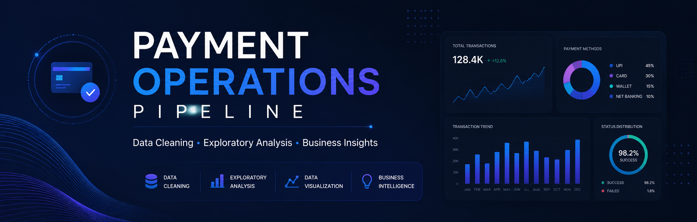

# Payment-Ops-Pipeline

  

## Overview

An end-to-end data analytics project demonstrating data cleaning, preprocessing, exploratory data analysis (EDA), and business insight generation using Python and modern analytics libraries.

| Capability    | Description                                   |
| ------------- | --------------------------------------------- |
| Data Cleaning | Standardized raw payment records              |
| Preprocessing | Missing value treatment and duplicate removal |
| EDA           | Statistical summaries and visual exploration  |
| Visualization | Charts for business insights                  |
| Reporting     | Automated data quality summary                |

## Key Insights

- Improved overall dataset quality through preprocessing.
- Identified transaction distribution patterns.
- Generated visual reports to support business decisions.
- Established a reusable analytics workflow.

